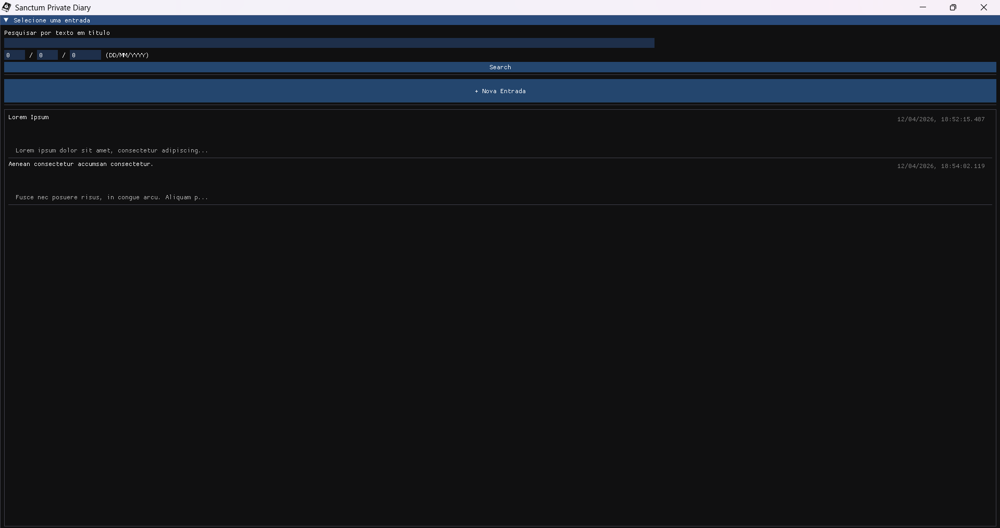
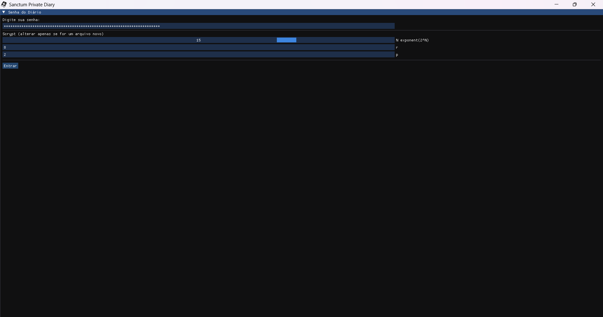
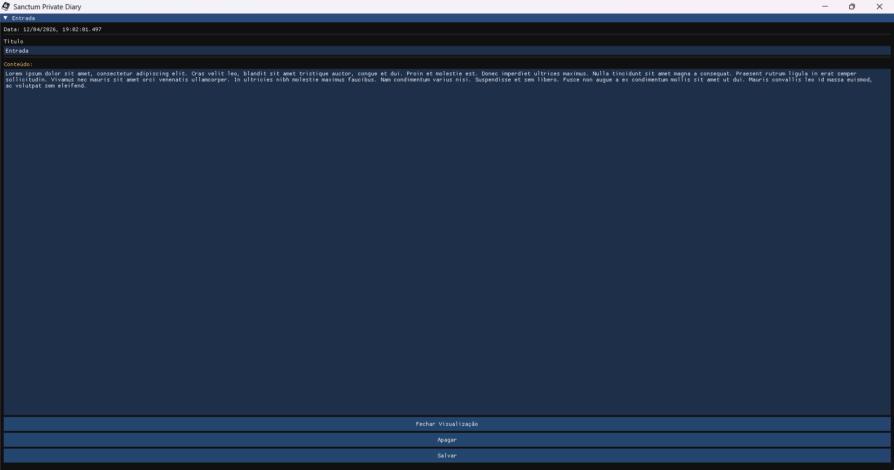

<p align="center">
  
  
  
</p>

# Sanctum


Um diário local e criptografado para Windows. As entradas são protegidas com criptografia autenticada ChaCha20-Poly1305, e a chave mestra é derivada da sua senha usando scrypt.

## Funcionalidades

- **Criptografado em repouso** — todas as entradas são criptografadas com ChaCha20-Poly1305 (AEAD)
- **Derivação de chave configurável** — os parâmetros do scrypt (N, r, p) são escolhidos na criação do diário e armazenados no cabeçalho do cofre
- **Integração com o Windows Hello** — a chave de sessão pode ser encapsulada/desencapsulada usando o Windows Hello para reautenticação simplificada
- **Bloqueio automático** — o diário é bloqueado automaticamente após 60 segundos de inatividade ou quando a sessão é trancada
- **Gerenciamento seguro de memória** — buffers sensíveis são zerados após o uso e bloqueados na memória para evitar a troca para disco
- **Negação plausível (Duress Password)** — suporte a uma senha de coação que desbloqueia um volume de fachada (decoy), protegendo a existência dos seus dados reais em cenários de adversidade.
- **Busca de entradas** — permite pesquisar entradas por título ou data
- **Interface imediata** — construída com [Dear ImGui](https://github.com/ocornut/imgui) + OpenGL/GLFW, sem dependências de frameworks de GUI pesados

## Download

Você pode baixar o executável pronto para uso na página de **[Releases](https://github.com)**.

> [!IMPORTANT]
> **Nota de Segurança:** Por ser um software de criptografia com implementações próprias, recomenda-se que usuários avançados auditem o código e compilem o binário manualmente. O binário pré-compilado é fornecido para conveniência, mas a segurança total é garantida pela transparência do código-fonte.

**Instruções para o Binário:**
1. Baixe o `Sanctum.zip`.
2. Extraia o conteúdo (NÃO APAGUE A `glfw3.dll`).
3. Leia o guia que estará junto com o executável caso for leigo.
4. Execute o `Sanctum.exe`.

## Implementações Criptográficas

Todas as primitivas criptográficas são implementadas do zero — nenhuma OpenSSL, libsodium ou API de criptografia do SO é usada para o trabalho central de cifra.

| Primitiva | Notas |
|---|---|
| ChaCha20-Poly1305 | Otimizado com AVX-512; processa múltiplos blocos em paralelo usando registradores de 512 bits |
| SHA-256 | Implementação escalar portável (sem SHA-NI) |
| scrypt | Construído sobre as implementações de ChaCha20 e SHA-256 acima |

Todas as implementações são validadas contra os vetores de teste oficiais IETF/NIST para suas respectivas primitivas.

## Formato do Cofre

Cada arquivo `.sdde` é um binário plano com o seguinte layout:

```
[16 bytes — salt (texto simples)]
[16 bytes — parâmetros do scrypt: N (8 bytes LE) + r (4 bytes LE) + p (4 bytes LE)]
[Entrada de validação]
[Entrada duress]
[Entrada 1]
[Entrada 2]
...
```

Cada entrada é serializada como:

```
[16 bytes — tag de autenticação Poly1305]
[12 bytes — nonce do ChaCha20]
[ 8 bytes — comprimento do título (LE)]
[ 8 bytes — comprimento do conteúdo (LE)]
[ 8 bytes — timestamp (LE) (usado como AAD)]
[N bytes — título + conteúdo criptografados (concatenados, único texto cifrado)]
```

A primeira entrada após o cabeçalho é uma entrada de validação aleatória: 32 bytes de dados CSPRNG criptografados com a chave derivada. Na abertura, descriptografá-la e verificar a tag Poly1305 confirma que a chave está correta sem depender de nenhum texto simples conhecido. Em cada salvamento, ela é substituída por uma entrada recém-aleatória.

## Compilação

Requisitos:
- Windows (APIs do Windows Hello são usadas para encapsulamento da chave de sessão)
- Preferencialmente CPU com suporte a AVX-512 (para velocidade, mas funciona em outras CPUs graças aos Vetores Estendidos do Clang)
- Clang com suporte a C++20
- GLFW3 (`glfw3.dll` deve estar presente junto ao executável)

```bat
build.bat
```

O script de compilação compila `main.cpp` junto com todos os fontes do ImGui em `include/imgui/`.

## Uso

1. Execute `Sanctum.exe`
2. Informe um caminho para um diário novo ou existente (sem a extensão `.sdde`)
3. **Novo diário:** escolha os parâmetros do scrypt (expoente N, r, p) e defina uma senha — os parâmetros são armazenados no cofre e não precisam ser inseridos novamente
4. **Diário existente:** informe sua senha — os parâmetros são lidos automaticamente do cofre
5. Crie, visualize, edite e exclua entradas
6. O diário é bloqueado automaticamente após 60 segundos sem foco; desbloqueie com o Windows Hello

## Notas de Segurança

- Os parâmetros do scrypt são configuráveis no momento da criação. Um N maior aumenta o custo de derivação de chave e a resistência a ataques offline. Os parâmetros são armazenados sem criptografia no cabeçalho do cofre — isso é intencional, pois não contêm nenhuma informação secreta.
- Título e conteúdo são concatenados em um único texto simples antes da criptografia. Os comprimentos são armazenados no cabeçalho para que possam ser separados na descriptografia. Isso significa que a tag cobre ambos os campos juntos.
- Os nonces são gerados aleatoriamente por entrada usando um CSPRNG. Um novo nonce é gerado sempre que uma entrada é criada ou salva novamente.
- `CryptoHelper::secure_zero_memory` é usado em todos os buffers sensíveis antes da desalocação para evitar que segredos permaneçam na memória do processo.
- O encapsulamento de chave pelo Windows Hello é uma conveniência de sessão — a chave derivada bruta nunca é gravada em disco em nenhuma forma.

## Como associar o Sanctum a arquivos .sdde

1. Abra o Prompt de Comando como Administrador
2. Execute:
   ```bat
   assoc .sdde=SanctumDiary
   ftype SanctumDiary="C:\caminho\para\sanctum.exe" "%1"
   ```

## Créditos
[Icon.ico criado por Marsiholo - Flaticon](https://www.flaticon.com/free-icons/secret)

## Estrutura do Projeto

```
main.cpp                        — Ponto de entrada da aplicação e loop de renderização
include/
  app_state.hpp                 — Estado global da aplicação (g_state)
  app_pages.hpp                 — Todas as implementações de páginas/telas ImGui
  encryption/
    aead/chacha20_poly1305.hpp  — Construção AEAD
    primitives/chacha20.hpp     — Cifra de fluxo ChaCha20
    primitives/poly1305.hpp     — MAC Poly1305
  hash/sha256.hpp               — SHA-256
  kdf/scrypt.hpp                — Derivação de chave scrypt
  utils/
    crypto_helpers.hpp          — Memória segura, Windows Hello, CSPRNG
    diary_helper.hpp            — Serialização/desserialização de entradas
    file_ops.hpp                — E/S de arquivos binários
  imgui/                        — Fonte do Dear ImGui (vendored)
  GLFW/                         — Cabeçalhos do GLFW
```